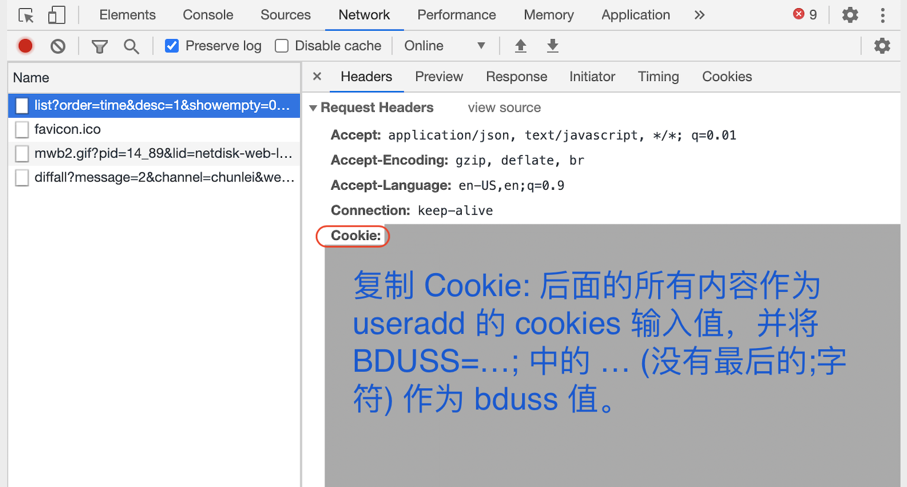

# BaiduPCS-Py

[](https://badge.fury.io/py/baidupcs-py)

[](https://gitter.im/PeterDing/BaiduPCS-Py?utm_source=badge&utm_medium=badge&utm_campaign=pr-badge)

A BaiduPCS API and An App

BaiduPCS-Py 是百度网盘 pcs 的非官方 api 和一个命令行运用程序。

> 也是 https://github.com/PeterDing/iScript/blob/master/pan.baidu.com.py 的重构版。

**BaiduPCS-Py 旨在为个人用户提供操作自己用户网盘文件的 api 和简易命令行工具，不提供任何下载加速破解的服务。普通用户下载是限速的。想要下载不限速，请购买 SVIP。**

- [安装](#安装)
- [更新](#更新)
- [API](#API)
- [用法](#用法)
- [命令别名](#命令别名)
- [对多个帐号进行相同操作](#对多个帐号进行相同操作)

#### 用户相关命令

- [添加用户](#添加用户)
- [显示当前用户的信息](#显示当前用户的信息)
- [更新用户信息](#更新用户信息)
- [显示所有用户](#显示所有用户)
- [切换当前用户](#切换当前用户)
- [删除一个用户](#删除一个用户)
- [显示当前工作目录](#显示当前工作目录)
- [切换当前工作目录](#切换当前工作目录)

#### 无感加密解密文件

- [设置文件加密密码](#设置文件加密密码)

#### 文件操作相关命令

- [文件操作](#文件操作)
- [列出网盘路径下的文件](#列出网盘路径下的文件)
- [搜索文件](#搜索文件)
- [显示文件内容](#显示文件内容)
- [创建目录](#创建目录)
- [移动文件](#移动文件)
- [文件重命名](#文件重命名)
- [拷贝文件](#拷贝文件)
- [删除文件](#删除文件)
- [下载文件或目录](#下载文件或目录)
- [播放媒体文件](#播放媒体文件)
- [上传文件](#上传文件)
- [同步本地目录到远端](#同步本地目录到远端)

#### 秒传相关命令

- [关于秒传](#关于秒传)
- [显示网盘中文件的秒传连接](#显示网盘中文件的秒传连接)
- [列出保存的文件秒传信息](#列出保存的文件秒传信息)
- [搜索保存的文件秒传信息](#搜索保存的文件秒传信息)
- [用秒传连接或参数上传](#用秒传连接或参数上传)

#### 分享相关命令

- [分享文件](#分享文件)
- [列出分享链接](#列出分享链接)
- [取消分享链接](#取消分享链接)
- [列出其他用户分享链接中的文件](#列出其他用户分享链接中的文件)
- [保存其他用户分享的链接](#保存其他用户分享的链接)

#### 离线下载相关命令

- [添加离线下载任务](#添加离线下载任务)
- [列出离线下载任务](#列出离线下载任务)
- [清除已经下载完和下载失败的任务](#清除已经下载完和下载失败的任务)
- [取消下载任务](#取消下载任务)
- [删除所有离线下载任务](#删除所有离线下载任务)

#### HTTP 服务

- [开启 HTTP 服务](#开启-HTTP-服务)

## 安装

需要 Python 版本大于或等于 3.7

```
pip3 install Cython
pip3 install BaiduPCS-Py
```

### Windows 依赖

在 Windows 上，BaiduPCS-Py 依赖 [Microsoft C++ Build Tools](https://visualstudio.microsoft.com/visual-cpp-build-tools/)。

在安装 BaiduPCS-Py 前，请先安装 [Microsoft C++ Build Tools](https://visualstudio.microsoft.com/visual-cpp-build-tools/)，再在其中勾选 `C++ 生成工具` 并安装。完成后即可安装 BaiduPCS-Py。

## 更新

```
pip3 install BaiduPCS-Py --upgrade
```

## API

BaiduPCS-Py 的百度网盘 API 只依赖 requests，方便用户开发自己的运用。

```python
from baidupcs_py.baidupcs import BaiduPCSApi

api = BaiduPCSApi(bduss=bduss, cookies=cookies)
```

注意，下面几个 api 不是线程安全的：

- `BaiduPCSApi.access_shared`
- `BaiduPCS.access_shared`
- `BaiduPCSApi.shared_paths`
- `BaiduPCS.shared_paths`

## 用法

```
BaiduPCS-Py --help
```

## 命令别名

可以用下面的命令别名代替原来的命令名。

| 别名 | 原名            |
| ---- | --------------- |
| w    | who             |
| uu   | updateuser      |
| su   | su              |
| ul   | userlist        |
| ua   | useradd         |
| ep   | encryptpwd      |
| ud   | userdel         |
| l    | ls              |
| f    | search          |
| md   | mkdir           |
| mv   | move            |
| rn   | rename          |
| cp   | copy            |
| rm   | remove          |
| d    | download        |
| p    | play            |
| u    | upload          |
| sn   | sync            |
| rl   | rplist          |
| rs   | rpsearch        |
| rp   | rp              |
| S    | share           |
| sl   | shared          |
| cs   | cancelshared    |
| lsp  | listsharedpaths |
| s    | save            |
| a    | add             |
| t    | tasks           |
| ct   | cleartasks      |
| cct  | canceltasks     |
| sv   | server          |

## 对多个帐号进行相同操作

BaiduPCS-Py 支持对多个帐号进行相同操作。比如，用相同关键字搜索多个帐号，上传相同的文件/目录到多个帐号，等等。

使用者只需用 `--users` 选项来指定要操作的帐号名即可。

`--users` 接受一个参数，这个参数是用“,”连接的要进行操作帐号名的部分字符。假设我们现在有 3 个帐号，帐号名分别是 `Tom`，`Peter`，`Joy`。
现在我要同时对`Tom`和`Joy`进行关键字搜索。我们可以用下面的命令进行：

```
BaiduPCS-Py --users 'Tom,Joy' search 'keyword' / -R
```

或者给出帐号名的部分片段：

```
BaiduPCS-Py --users 'om,oy' search 'keyword' / -R
```

更简单可以用：

```
# Tom, Joy 都包含字符 "o"
BaiduPCS-Py --users 'o' search 'keyword' / -R
```

如果要对所有帐号进行操作用 `--users ''`。

如果不使用 `--users` 选项，默认只对当前帐号进行操作。

以下命令支持对多个帐号进行操作：

- pwd
- ls
- search
- cat
- mkdir
- move
- rename
- copy
- remove
- download
- play
- upload
- sync
- rp
- share
- shared
- cancelshared
- save
- add
- tasks
- cleartasks
- canceltasks
- purgetasks
- server

**注意**: `--users` 一定要跟在 `BaiduPCS-Py` 后，命令前。

## 添加用户

BaiduPCS-Py 目前不支持用帐号登录。需要使用者在 pan.baidu.com 登录后获取 cookies 和其中的 bduss 值，并用命令 `useradd` 为 BaiduPCS-Py 添加一个用户。

使用者可以用下面的方式获取用户的 cookies 和 bduss 值。

1. 登录 pan.baidu.com
2. 打开浏览器的开发者工具(如 Chrome DevTools)。
3. 然后选择开发者工具的 Network 面板。
4. 在登录后的页面中任意点开一个文件夹。
5. 在 Network 面板中找到 `list?....` 一行，然后在右侧的 Headers 部分找到 `Cookie:` 所在行，复制 `Cookie:` 后的所有内容作为 cookies 值，其中的 `BDUSS=...;` 的 `...` (没有最后的字符;)作为 bduss 值。



现在找到了 cookies 和 bduss 值，我们可以用下面的命令添加一个用户。

交互添加：

```
BaiduPCS-Py useradd
```

或者直接添加：

```
BaiduPCS-Py useradd --cookies "cookies 值" --bduss "bduss 值"
```

你也可以只添加 `bduss`，省去 `cookies` (或 `cookies` 中没有 `STOKEN` 值)，但这会让你无发使用 `share` 和 `save` 命令来转存其他用法的分享文件。

BaiduPCS-Py 支持多用户，你只需一直用 `useradd` 来添加用户即可。

## 显示当前用户的信息

```
BaiduPCS-Py who
```

或者：

```
BaiduPCS-Py who user_id
```

指明显示用户 id 为 `user_id` 的用户信息。

### 选项

| Option                      | Description  |
| --------------------------- | ------------ |
| -K, --show-encrypt-password | 显示加密密码 |

## 更新用户信息

默认更新当前用户信息。

```
BaiduPCS-Py updateuser
```

也可指定多个 `user_id`

```
BaiduPCS-Py updateuser user_id
```

## 显示所有用户

```
BaiduPCS-Py userlist
```

## 切换当前用户

```
BaiduPCS-Py su
```

或者指定用户列表中用户所在的位置：

```
BaiduPCS-Py su 2
```

## 删除一个用户

```
BaiduPCS-Py userdel
```

## 设置文件加密密码

> **注意**： `v0.5.17` 加密的文件格式(Version 2)不兼容以后的版本。

BaiduPCS-Py 支持“无感的”文件加密。

BaiduPCS-Py 可以加密上传文件，在下载的时候自动解密，让使用者感觉不到加密解密的过程。

如果使用者需要将保密文件上传至百度网盘保存，可以使用这个方法。即使帐号被盗，攻击者也无法还原文件内容。

BaiduPCS-Py 支持以下加密方法：

- **Simple** 一种简单的加密算法。根据密钥生成一个字节对照表来加密解密文件。
  速度快，但**不安全**，不建议加密重要文件。
  因为这种算法加解密不需要知道上下文信息，所以，下载时支持分段下载，如果是媒体文件则支持拖动播放。
  推荐用于加密不重要的媒体文件。
- **ChaCha20** 工业级加密算法，速度快，推荐用于加密重要文件。不支持分段下载。
- **AES256CBC** 工业级加密算法，推荐用于加密重要文件。不支持分段下载。

**注意**：用命令 `encryptpwd` 设置的密码**只是为当前用户**的。

为当前用户设置加密密码:

交互添加：

```
BaiduPCS-Py encryptpwd
```

或者直接添加：

```
BaiduPCS-Py encryptpwd --encrypt-password 'my-encrypt-password'
```

上传并加密文件：

上传和同步文件时只需要指定加密算法就可。如果不指定就不加密。

```
# 默认使用上面设置的 `encrypt-password`
BaiduPCS-Py upload some-file.mp4 some-dir/ /to/here --encrypt-type AES256CBC
```

下载并用上面设置的 `encrypt-password` 自动解密文件：

```
BaiduPCS-Py download /to/here/some-file.mp4 /to/here/some-dir/
```

也可以使用临时的 `encrypt-password`：

```
BaiduPCS-Py upload some-file.mp4 some-dir/ /to/here --encrypt-type Simple --encrypt-password 'onlyyou'
```

但在使用临时的 `encrypt-password` 后，`cat`、下载和播放这些文件时需要指定 `encrypt-password`，但不需要指定加密算法，程序会自动检查加密算法：

```
# 下载
BaiduPCS-Py download /to/here/some-file.mp4 /to/here/some-dir/  --encrypt-password 'onlyyou'

# 开启本地服务并播放
BaiduPCS-Py play /to/here/some-file.mp4 --encrypt-password 'onlyyou' --use-local-server
```

显示当前用户的密钥：

```
BaiduPCS-Py who --show-encrypt-password
```

BaiduPCS-Py 下载时默认会解密文件，如果想要下载但不解密文件，需要加 `--no-decrypt`

```
BaiduPCS-Py download some-file --no-decrypt
```

## 文件操作

BaiduPCS-Py 操作网盘中的文件可以使用文件的绝对路径或相对路径（相对与当前目录 pwd）。

每一个用户都有自己的当前工作目录（pwd），默认为 `/` 根目录。

使用者可以用 `cd` 命令来切换当前的工作目录（pwd）。

下面所有涉及网盘路径的命令，其中如果网盘路径用的是相对路径，那么是相对于当前工作目录（pwd）的。
如果是网盘路径用的是绝对路径，那么就是这个绝对路径。

## 显示当前工作目录

```
BaiduPCS-Py pwd
```

## 切换当前工作目录

切换到绝对路径：

```
BaiduPCS-Py cd /to/some/path
```

切换到相对路径：

```
# 切换到 (pwd)/../path
BaiduPCS-Py cd ../path
```

## 列出网盘路径下的文件

```
BaiduPCS-Py ls [OPTIONS] [REMOTEPATHS]...

BaiduPCS-Py ls /absolute/path

# or
BaiduPCS-Py ls relative/path
```

### 选项

| Option                                               | Description                                           |
| ---------------------------------------------------- | ----------------------------------------------------- |
| -r, --desc                                           | 逆序排列文件                                          |
| -n, --name                                           | 依名字排序                                            |
| -t, --time                                           | 依时间排序                                            |
| -s, --size                                           | 依文件大小排序                                        |
| -R, --recursive                                      | 递归列出文件                                          |
| -I, --include TEXT                                   | 筛选包含这个字符串的文件                              |
| --include-regex, --IR TEXT                           | 筛选包含这个正则表达式的文件                          |
| -E, --exclude TEXT                                   | 筛选 **不** 包含这个字符串的文件                      |
| --exclude-regex, --ER TEXT                           | 筛选 **不** 包含这个正则表达式的文件                  |
| -f, --is-file                                        | 筛选 **非** 目录文件                                  |
| -d, --is-dir                                         | 筛选目录文件                                          |
| --no-highlight, --NH                                 | 取消匹配高亮                                          |
| -S, --show-size                                      | 显示文件大小                                          |
| -D, --show-date                                      | 显示文件创建时间                                      |
| -M, --show-md5                                       | 显示文件 md5                                          |
| -A, --show-absolute-path                             | 显示文件绝对路径                                      |
| --show-dl-link, --DL                                 | 显示文件下载连接                                      |
| --show-hash-link, --HL                               | 显示文件秒传连接                                      |
| --hash-link-protocol, --HLP [cs3l \| short \| bdpan] | 显示文件 hash 链接，并指定协议                        |
| --no-check-md5, --NC                                 | 显示文件 cs3l:// 连接时不检查 md5                     |
| --csv                                                | 用 csv 格式显示，单行显示，推荐和 --DL 或 --HL 一起用 |
| --only-dl-link, --ODL                                | 只显示文件下载连接                                    |
| --only-hash-link, --OHL                              | 只显示文件秒传连接                                    |

## 搜索文件

搜索包含 `keyword` 的文件

```
BaiduPCS-Py search [OPTIONS] KEYWORD [REMOTEDIR]

# 在当前工作目录中搜索
BaiduPCS-Py search keyword

# or
BaiduPCS-Py search keyword /absolute/path

# or
BaiduPCS-Py search keyword relative/path
```

### 选项

| Option                     | Description                          |
| -------------------------- | ------------------------------------ |
| -R, --recursive            | 递归搜索文件                         |
| -I, --include TEXT         | 筛选包含这个字符串的文件             |
| --include-regex, --IR TEXT | 筛选包含这个正则表达式的文件         |
| -E, --exclude TEXT         | 筛选 **不** 包含这个字符串的文件     |
| --exclude-regex, --ER TEXT | 筛选 **不** 包含这个正则表达式的文件 |
| -f, --is-file              | 筛选 **非** 目录文件                 |
| -d, --is-dir               | 筛选目录文件                         |
| --no-highlight, --NH       | 取消匹配高亮                         |
| -S, --show-size            | 显示文件大小                         |
| -D, --show-date            | 显示文件创建时间                     |
| -M, --show-md5             | 显示文件 md5                         |
| --csv                      | 用 csv 格式显示                      |

## 显示文件内容

```
BaiduPCS-Py cat [OPTIONS] REMOTEPATH
```

### 选项

| Option                        | Description                  |
| ----------------------------- | ---------------------------- |
| -e, --encoding TEXT           | 文件编码，默认自动解码       |
| --no-decrypt, --ND            | 不解密                       |
| --encrypt-password, --ep TEXT | 加密密码，默认使用用户设置的 |

## 创建目录

```
BaiduPCS-Py mkdir [OPTIONS] [REMOTEDIRS]...
```

### 选项

| Option     | Description |
| ---------- | ----------- |
| -S, --show | 显示目录    |

## 移动文件

移动一些文件到一个目录中。

```
BaiduPCS-Py move [OPTIONS] [REMOTEPATHS]... REMOTEDIR
```

### 选项

| Option     | Description |
| ---------- | ----------- |
| -S, --show | 显示结果    |

## 文件重命名

```
BaiduPCS-Py rename [OPTIONS] SOURCE DEST
```

### 选项

| Option     | Description |
| ---------- | ----------- |
| -S, --show | 显示结果    |

## 拷贝文件

拷贝一些文件到一个目录中。

```
BaiduPCS-Py move [OPTIONS] [REMOTEPATHS]... REMOTEDIR
```

### 选项

| Option     | Description |
| ---------- | ----------- |
| -S, --show | 显示结果    |

## 删除文件

```
BaiduPCS-Py remove [OPTIONS] [REMOTEPATHS]...
```

## 下载文件或目录

```
BaiduPCS-Py download [OPTIONS] [REMOTEPATHS]...
```

> **注意**: 请用 `me`, `aget_py` 或 `aget_rs` 下载大于 50MB 的文件。用 aria2 下载大于 50MB 的文件会失败。 ([#27](https://github.com/PeterDing/BaiduPCS-Py/issues/27))

### 选项

| Option                                                 | Description                                                                                                                                                                                                                                                                                                                                                                                                                                                                                          |
| ------------------------------------------------------ | ---------------------------------------------------------------------------------------------------------------------------------------------------------------------------------------------------------------------------------------------------------------------------------------------------------------------------------------------------------------------------------------------------------------------------------------------------------------------------------------------------- |
| -o, --outdir TEXT                                      | 指定下载本地目录，默认为当前目录                                                                                                                                                                                                                                                                                                                                                                                                                                                                     |
| -R, --recursive                                        | 递归下载                                                                                                                                                                                                                                                                                                                                                                                                                                                                                             |
| -f, --from-index INTEGER                               | 从所有目录中的第几个文件开始下载，默认为 0（第一个）                                                                                                                                                                                                                                                                                                                                                                                                                                                 |
| -I, --include TEXT                                     | 筛选包含这个字符串的文件                                                                                                                                                                                                                                                                                                                                                                                                                                                                             |
| --include-regex, --IR TEXT                             | 筛选包含这个正则表达式的文件                                                                                                                                                                                                                                                                                                                                                                                                                                                                         |
| -E, --exclude TEXT                                     | 筛选 不 包含这个字符串的文件                                                                                                                                                                                                                                                                                                                                                                                                                                                                         |
| --exclude-regex, --ER TEXT                             | 筛选 不 包含这个正则表达式的文件                                                                                                                                                                                                                                                                                                                                                                                                                                                                     |
| -s, --concurrency INTEGER                              | 下载同步链接数，默认为 5。数子越大下载速度越快，但是容易被百度封锁                                                                                                                                                                                                                                                                                                                                                                                                                                   |
| -k, --chunk-size TEXT                                  | 同步链接分块大小，最大不能超过 50MB                                                                                                                                                                                                                                                                                                                                                                                                                                                                  |
| -q, --quiet                                            | 取消第三方下载应用输出                                                                                                                                                                                                                                                                                                                                                                                                                                                                               |
| --out-cmd, --OC                                        | 输出第三方下载应用命令                                                                                                                                                                                                                                                                                                                                                                                                                                                                               |
| -d, --downloader [ me \| aget_py \| aget_rs \| aria2 ] | 指定下载应用<br> <br> 默认为 me (BaiduPCS-Py 自己的下载器，支持断续下载)<br> me 使用多文件并发下载。<br> <br> 除 me 外，其他下载器，不使用多文件并发下载，使用一个文件多链接下载。<br> 如果需要下载多个小文件推荐使用 me，如果需要下载少量大文件推荐使用其他下载器。对于 SVIP 用户，用哪个下载器都很快。<br> <br> aget_py (https://github.com/PeterDing/aget) 默认安装<br> aget_rs (下载 https://github.com/PeterDing/aget-rs/releases)<br> aria2 (下载 https://github.com/aria2/aria2/releases)<br> |
| --encrypt-password, --ep TEXT                          | 加密密码，默认使用用户设置的                                                                                                                                                                                                                                                                                                                                                                                                                                                                         |

## 播放媒体文件

```
BaiduPCS-Py play [OPTIONS] [REMOTEPATHS]...
```

**注意**: 大于 **50MB** 的媒体文件无法直接播放，需要加 `-s` 使用本地服务器播放。

`play` 命令默认播放带有媒体后缀的文件，如 `abc.mp4`, `abc.mp3`。如果需要播放的媒体文件没有用常规的媒体文件后缀，则需要加选项 `--ignore-ext`。

### 选项

| Option                        | Description                                                                   |
| ----------------------------- | ----------------------------------------------------------------------------- |
| -R, --recursive               | 递归播放                                                                      |
| -f, --from-index INTEGER      | 从所有目录中的第几个文件开始播放，默认为 0（第一个）                          |
| -I, --include TEXT            | 筛选包含这个字符串的文件                                                      |
| --include-regex, --IR TEXT    | 筛选包含这个正则表达式的文件                                                  |
| -E, --exclude TEXT            | 筛选 不 包含这个字符串的文件                                                  |
| --exclude-regex, --ER TEXT    | 筛选 不 包含这个正则表达式的文件                                              |
| --player-params, --PP TEXT    | 第三方播放器参数                                                              |
| -m, --m3u8                    | 获取 m3u8 文件并播放                                                          |
| -q, --quiet                   | 取消第三方播放器输出                                                          |
| --shuffle, --sf               | 随机播放                                                                      |
| --ignore-ext, --IE            | 不用文件名后缀名来判断媒体文件                                                |
| --out-cmd, --OC               | 输出第三方播放器命令                                                          |
| -p, --player [mpv]            | 指定第三方播放器<br><br>默认为 mpv (https://mpv.io)                           |
| -s, --use-local-server        | 使用本地服务器播放。大于 50MB 的媒体文件无法直接播放，需要使用本地服务器播放 |
| --encrypt-password, --ep TEXT | 加密密码，默认使用用户设置的                                                  |

## 上传文件

上传一些本地文件或目录到网盘目录。

BaiduPCS-Py 首先会尝试秒传。如果秒传失败，会使用分片上传上传文件。

上传过程中，按 “p” 可以暂停或继续上传。

```
BaiduPCS-Py upload [OPTIONS] [LOCALPATHS]... REMOTEDIR
```

### 注意：upload 上传本地目录有改变

- 小于 v0.6.8 的版本，如果上传本地目录 `localdir` 到远端目录 `remotedir`，BaiduPCS-Py 是将 `localdir` 下的所有文件（包括下级目录）上传到远端目录 `remotedir` 下。

  比如，`localdir` 下有 2 个文件 `a`，`b` 和一个下级目录 `sub/`，如果运行 `BaiduPCS-Py upload localdir remotedir`，结果是远端目录 `remotedir` 下增加了 2 个文件 `a`，`b` 和一个下级目录 `sub/`。

- 大于或等于 v0.6.8 的版本，如果上传本地目录 `localdir` 到远端目录 `remotedir`，BaiduPCS-Py 是将 `localdir` 这个目录上传到远端目录 `remotedir` 下。

  比如，`localdir` 下有 2 个文件 `a`，`b` 和一个下级目录 `sub/`，如果运行 `BaiduPCS-Py upload localdir remotedir`，结果是远端目录 `remotedir` 下增加了 1 个下级目录和它的所有文件 `localdir/a`，`localdir/b` 和一个下级目录 `localdir/sub/`。

  如果要将 `localdir` 下的所有文件（包括下级目录）上传到远端目录 `remotedir`，用 `BaiduPCS-Py upload localdir/* remotedir`

### 选项

| Option                                                     | Description                                                                                |
| ---------------------------------------------------------- | ------------------------------------------------------------------------------------------ |
| --encrypt-password, --ep TEXT                              | 加密密码，默认使用用户设置的                                                               |
| -e, --encrypt-type [No \| Simple \| ChaCha20 \| AES256CBC] | 文件加密方法，默认为 No 不加密                                                             |
| -w, --max-workers INTEGER                                  | 同时上传文件数                                                                             |
| --no-ignore-existing, --NI                                 | 上传已经存在的文件                                                                         |
| --no-show-progress, --NP                                   | 不显示上传进度                                                                             |
| --check-md5, --CM                                          | 分段上传后检查 md5。注意检查上传后大文件的 md5，可能会花数分中（2G 的文件需要大约 5 分钟） |

## 同步本地目录到远端

同步本地目录到远端。

如果本地文件最后修改时间或大小和远端不同则上传文件。对于本地不存在的文件但远端存在则删除远端文件。

```
BaiduPCS-Py sync [OPTIONS] LOCALDIR REMOTEDIR
```

### 选项

| Option                                                     | Description                                                                                |
| ---------------------------------------------------------- | ------------------------------------------------------------------------------------------ |
| --encrypt-password, --ep TEXT                              | 加密密码，默认使用用户设置的                                                               |
| -e, --encrypt-type [No \| Simple \| ChaCha20 \| AES256CBC] | 文件加密方法，默认为 No 不加密                                                             |
| -w, --max-workers INTEGER                                  | 同时上传文件数                                                                             |
| --no-show-progress, --NP                                   | 不显示上传进度                                                                             |
| --check-md5, --CM                                          | 分段上传后检查 md5。注意检查上传后大文件的 md5，可能会花数分中（2G 的文件需要大约 5 分钟） |

## 关于秒传

百度网盘在服务器上对于一份文件只储存一份。如果一份文件已经存在于百度网盘的服务器中，用户无需重新上传源文件，只需要提供文件的特征参数就可完成上传，这种上传文件的方法百度叫做“**秒传**”。

运用“秒传”的功能，我们将一份文件变成一组特征参数。只要获得这组特征参数，我们就可以在百度网盘中“生成”这组特征参数对应的唯一文件。

BaiduPCS-Py 可以获取百度网盘中文件的特征参数，并将其转化为一串连接。使用这个连接，使用者可以在任何帐号中“生成”对应文件，达到文件分享的功能。

BaiduPCS-Py 支持 3 种秒传连接(在 BaiduPCS-Py 叫 Hash Link)协议：

1. `cs3l`

`cs3l` 是 <b>C</b>ontent_md5 + <b>S</b>lice256k_md5 + content_crc<b>3</b>2 + content\_<b>L</b>ength 的缩写。

格式: `cs3l://<content_md5>#<slice_md5>#<content_crc32>#<content_length>#<filename>`

例如: `cs3l://ced58db7aedce8e1c887754fccccde03#0d02589467f34bdd86d08221e93b2783#2518837112#33251183#test.gz`

BaiduPCS-Py 默认使用 `cs3l` 协议连接。

2. `short`

`short` 是 `cs3l` 格式的缩写版。最早出自于[梦姬度盘标准提取码](https://blog.jixun.moe/du-code-gen)。

格式: `<content_md5>#<slice_md5>#<content_length>#<filename>`

例如: `ced58db7aedce8e1c887754fccccde03#0d02589467f34bdd86d08221e93b2783#33251183#test.gz`

3. `bdpan`

`bdpan` 是 pandownload 使用的协议连接。

格式: `bdpan://{base64(<filename>|<content_length>|<content_md5>|<slice_md5>)}`

例如: `bdpan://Q29udGVudHMtYW1kNjQuZ3p8MzMyNTExODN8Y2VkNThkYjdhZWRjZThlMWM4ODc3NTRmY2NjY2RlMDN8MGQwMjU4OTQ2N2YzNGJkZDg2ZDA4MjIxZTkzYjI3ODM=`

BaiduPCS-Py 会将在命令 `ls`，`upload`，`sync`，`rp` 中遇到的文件特征参数存储于本地 sqlite3 数据库 `~/.baidupcs-py/rapiduploadinfo.sqlite3`。使用 `rplist`，`rpsearch` 命令可以查看这些信息。

## 显示网盘中文件的秒传连接

使用 `ls` 命令显示秒传连接默认会对文件进行秒传检查，已确认服务器是否已经将文件特征记录。

对于才上传的大文件，服务器不会立刻计算完文件的特征参数，这个过程可能持续数天的时间。在此期间秒传无法进行。

如果想略过秒传检查，用户可以用 `--no-check-md5` 选项。但这样生成的秒传连接可能是无效的。

> 注意：显示秒传连接需要请求文件 256KB 的内容。如果用户是非 svip 且请求的文件很多，那么这个过程要花很长时间。BaidPCS-Py 使用 10 个线程来请求，如果是非 svip，每个文件请求可能要花 5 秒。

```
# 默认显示 cs3l 协议连接
BaiduPCS-Py ls /path/to/file --show-hash-link

# 或者用 --show-hash-link 缩写 --HL
BaiduPCS-Py ls /path/to/file --HL
```

指定特定协议：

```
BaiduPCS-Py ls /path/to/file --show-hash-link --hash-link-protocol bdpan
```

如果连接过长，可以加选项 `--csv`，让输出变为 csv 格式。

```
BaiduPCS-Py ls /path/to/file --show-hash-link --csv
```

## 列出保存的文件秒传信息

```
BaiduPCS-Py rplist [OPTIONS] [IDS]...
```

如果不给出 ids，默认为对所有数据进行操作。

### 选项

| Option                                               | Description               |
| ---------------------------------------------------- | ------------------------- |
| -f, --filename                                       | 按文件名排序              |
| -t, --time                                           | 按时间排序                |
| -s, --size                                           | 按文件大小排序            |
| -l, --localpath                                      | 按本地名排序              |
| -r, --remotepath                                     | 按远端名排序              |
| -u, --userid                                         | 按用户 id 排序            |
| -n, --username                                       | 按用户名排序              |
| -d, --desc                                           | 按逆序排序                |
| -L, --limit INTEGER                                  | 限制列出文件个数          |
| -O, --offset INTEGER                                 | 列出偏移位                |
| --hash-link-protocol, --HLP [cs3l \| short \| bdpan] | hash link 协议, 默认 cs3l |
| --show-all, -A                                       | 显示文件所有信息          |
| --only-hash-link, --OHL                              | 只显示文件秒传连接        |

## 搜索保存的文件秒传信息

```
BaiduPCS-Py rpsearch [OPTIONS] KEYWORD
```

### 选项

| Option                                               | Description                                    |
| ---------------------------------------------------- | ---------------------------------------------- |
| --filename, --fn                                     | 在文件名中搜索                                 |
| --localpath, --lp                                    | 在本地路径中搜索                               |
| --remotepath, --rp                                   | 在远端路径中搜索                               |
| --username, --un                                     | 在用户名中搜索                                 |
| -m, --md5                                            | 在 md5 中搜索。注意保存的文件 md5 都是小写字符 |
| --hash-link-protocol, --HLP [cs3l \| short \| bdpan] | hash link 协议, 默认 cs3l                      |
| --show-all, -A                                       | 显示文件所有信息                               |
| --only-hash-link, --OHL                              | 只显示文件秒传连接                             |

## 用秒传连接或参数上传

```
BaiduPCS-Py rp [OPTIONS] [REMOTEDIR]
```

使用秒传连接：

```
# 将秒传连接指向的文件保存到远端路径 /path/to/save
BaiduPCS-Py rp /path/to/save --link 'cs3l://ced58db7aedce8e1c887754fccccde03#0d02589467f34bdd86d08221e93b2783#2518837112#33251183#test.gz'

BaiduPCS-Py rp /path/to/save --link 'ced58db7aedce8e1c887754fccccde03#0d02589467f34bdd86d08221e93b2783#33251183#test.gz'

BaiduPCS-Py rp /path/to/save --link 'bdpan://Q29udGVudHMtYW1kNjQuZ3p8MzMyNTExODN8Y2VkNThkYjdhZWRjZThlMWM4ODc3NTRmY2NjY2RlMDN8MGQwMjU4OTQ2N2YzNGJkZDg2ZDA4MjIxZTkzYjI3ODM='
```

从指定文件获取要使用的秒传连接，文件中一行一个秒传连接。

```
BaiduPCS-Py rp /path/to/save --input-file links.txt --max-workers 5
```

使用特征参数：

```
BaiduPCS-Py rp /path/to/save \
    --content-md5 'ced58db7aedce8e1c887754fccccde03' \
    --slice-md5 '0d02589467f34bdd86d08221e93b2783' \
    --content-length '33251183' \
    --filename 'test.gz'
```

如果同时有 `--link` 和 `--filename`，那么 `--filename` 值将代替 link 中的文件名。

### 选项

| Option                         | Description                                            |
| ------------------------------ | ------------------------------------------------------ |
| -l, --link TEXT                | cs3l:// 协议连接 或 简化连接                           |
| -i, --input-file TEXT          | 从指定文件获取要使用的秒传连接；只能是一行一个秒传连接 |
| --slice-md5, --sm TEXT         | 文件前 256KB md5                                       |
| --content-md5, --cm TEXT       | 文件 md5                                               |
| --content-crc32, --cc INTEGER  | 文件 crc32, 可以为空                                   |
| --content-length, --cl INTEGER | 文件长度                                               |
| --filename, --fn TEXT          | 文件名，如果这里设置了，将会覆盖 link 中的文件名       |
| --no-ignore-existing, --NI     | 上传且覆盖已经存在的文件                               |
| -w, --max-workers INTEGER      | 同时上传文件数                                         |

## 分享文件

**注意：使用这个命令需要 cookies 中含有 `STOKEN` 值。**

```
BaiduPCS-Py share [OPTIONS] [REMOTEPATHS]...
```

### 选项

| Option              | Description                      |
| ------------------- | -------------------------------- |
| -p, --password TEXT | 设置秘密，4 个字符。默认没有秘密 |

## 列出分享链接

```
BaiduPCS-Py shared
```

### 选项

| Option         | Description                                  |
| -------------- | -------------------------------------------- |
| -A, --show-all | 显示所有分享的链接，默认只显示有效的分享链接 |

## 取消分享链接

```
BaiduPCS-Py cancelshared [OPTIONS] [SHARE_IDS]...
```

## 列出其他用户分享链接中的文件

**注意：使用这个命令需要 cookies 中含有 `STOKEN` 值。**

```
BaiduPCS-Py listsharedpaths [OPTIONS] SHARED_URL
```

### 选项

| Option                | Description                        |
| --------------------- | ---------------------------------- |
| -p, --password TEXT   | 链接密码，如果没有不用设置         |
| --no-show-vcode, --NV | 不显示验证码，如果需要验证码则报错 |

## 保存其他用户分享的链接

**注意：使用这个命令需要 cookies 中含有 `STOKEN` 值。**

保存其他用户分享的链接到远端目录。

```
BaiduPCS-Py save [OPTIONS] SHARED_URL REMOTEDIR
```

### 选项

| Option                | Description                        |
| --------------------- | ---------------------------------- |
| -p, --password TEXT   | 链接密码，如果没有不用设置         |
| --no-show-vcode, --NV | 不显示验证码，如果需要验证码则报错 |

## 添加离线下载任务

```
BaiduPCS-Py add [TASK_URLS]... REMOTEDIR
```

百度网盘支持添加 magnet 和 http/s 的离线任务。

如果添加 magnet 连接需要指定要下载的文件类型：

- m: 媒体文件 (默认)
- i: 图片文件
- d: 文档文件
- c: 压缩文件
- a: 所有文件

比如，要下载所有的媒体文件和文档文件：

```
BaiduPCS-Py add 'magnet:?xt=urn:btih:8e54536d364ad24f8a9b7ab0c08d52436341f131' /to/path --file-type 'm,d'
```

### 选项

| Option               | Description                                                                               |
| -------------------- | ----------------------------------------------------------------------------------------- |
| -t, --file-type TEXT | 要下载的文件类型，m:媒体文件，i:图片文件，d:文档文件，c:压缩文件，a:所有文件。用','分割。 |

## 列出离线下载任务

```
# 列出所有离线下载任务
BaiduPCS-Py tasks

# 也可列出给定id的任务。
BaiduPCS-Py tasks [TASK_IDS]...
```

## 清除已经下载完和下载失败的任务

```
BaiduPCS-Py cleartasks
```

## 取消下载任务

```
BaiduPCS-Py canceltasks [TASK_IDS]...
```

## 删除所有离线下载任务

```
BaiduPCS-Py purgetasks
```

### 选项

| Option | Description    |
| ------ | -------------- |
| --yes  | 确认并直接运行 |

## 开启 HTTP 服务

在远端 `ROOT_DIR` 目录下开启 HTTP 服务。

`ROOT_DIR` 默认为 `/`

```
BaiduPCS-Py BaiduPCS-Py server [OPTIONS] [ROOT_DIR]
```

如果需要设置认证，使用下面的选项设置用户名和密钥：

```
BaiduPCS-Py BaiduPCS-Py server [ROOT_DIR] --username 'foo' --password 'bar'
```

也可以指定服务路径：

```
BaiduPCS-Py BaiduPCS-Py server [ROOT_DIR] --path '/my/pan'

# 访问 http://localhost:8000/my/pan/
```

### 选项

| Option                        | Description                  |
| ----------------------------- | ---------------------------- |
| --path TEXT                   | 服务路径，默认为 “/”         |
| -h, --host TEXT               | 监听 host                    |
| -p, --port INTEGER            | 监听 port                    |
| -w, --workers INTEGER         | 进程数                       |
| --encrypt-password, --ep TEXT | 加密密码，默认使用用户设置的 |
| --username TEXT               | HTTP Basic Auth 用户名       |
| --password TEXT               | HTTP Basic Auth 密钥         |
